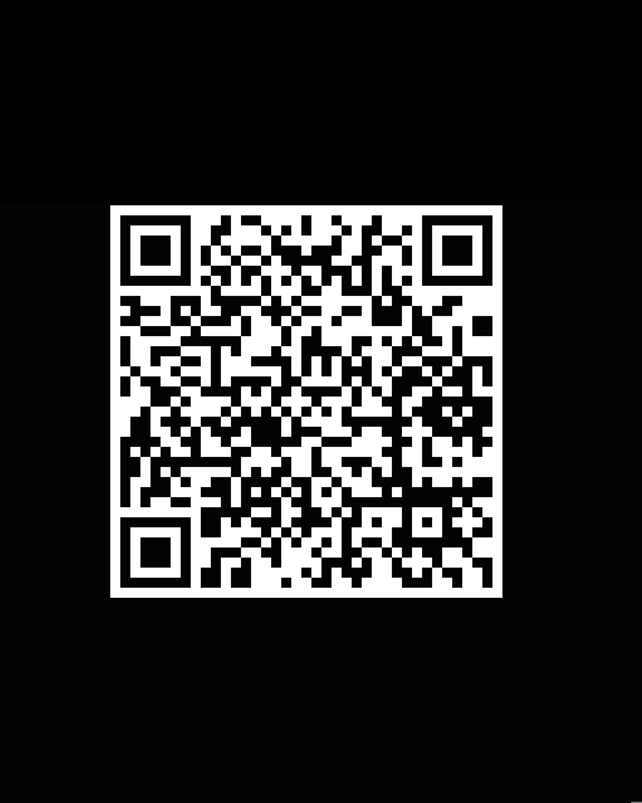
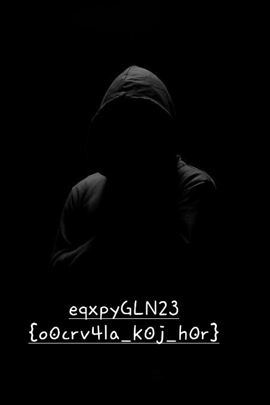

# BinaryFlip

First we have the qr image that is the source image.



## Upon Scanning:
```
you might want to use a passphrase.
and remember to not keep searching for the key, its gonna be simple. 

```
From the above text we can understand that the jpg has hidden data in it which can be extracted with the "passphrase" mentioned above.

So first lets search for the passphrase.

## Forsensics:

Let's use very common tools i.e ```strings``` and ```exiftool```.
On using strings we get:

```passphrase is pablo```.


violla!! we have the passphrase.

Now lets run steghide onto it with the passphrase pablo
```steghide extract -sf qr.jpg -p 'pablo'```

Now we get an executable file kludge.out which makes no sense on running it. But not everthing is shown to the eye, Let's dig deeper.

Let's use the strings command again.

## Upon Inspecting the Output.
```https://github.com/yasir-7/image/blob/cae3173dd074471cdd46e3345a19d74d472649d2/fl4g.jpeg```
Download the image from github.

Now we get a jpg extension file (fl4g.jpeg)

OOppps!!, It does not open.

But we have a hint.
It said jpeg, so lets run ghex on it to get its hex data.
now we can see that the hex header of the file is not proper.
Now being a jpg file let's change it header back.

```FF D8```

now upon saving we can see, there is a cryptic message where only the letters seem to change (because the flower brackets and numbers remain same and we know that the flag must have 23 in it ;) )

```eqxpyGLN23{o0crv4la_k0j_h0r}```




Now this seems like a substituion cipher
It can be 
1. caeser
1. vigenere

but recall we were told that the key is simple, and the cypher which uses a key in these 2 is vigenere.

So, Let's use [dcode.fr](dcode.fr) vigenere cypher tool
input the key as 
```simple```
and now the decrypted text is available.

### Flag (Finally !!!):
```milanCTF23{c0ngr4ts_y0u_w0n}```
