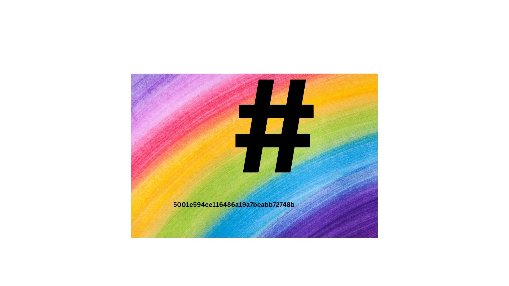
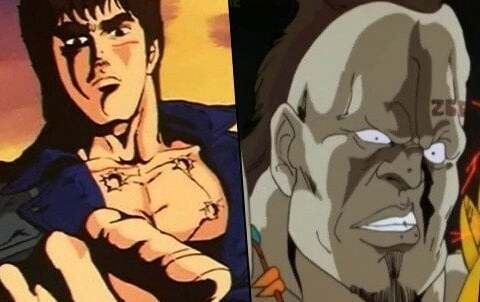

# Kenshiro Hide:

## from the link which was Provided and the zip.

#After Extracting the zip:

we get a folder containing


[1.txt](kenshirohide/1.txt)

```bWlsYW5DVEZ7Cg==```


[3.txt](kenshirohide/3.txt)

```L5GTA5K7```

4.jpg



[instruction.txt](kenshirohide/instruction.txt)

```
--->flag format is weeb{.....}

--->add all the strings to get your flag

--->the 4 letter villans reply will show u remaining hints


```

ignore the weeb{} line (Please take a look cores!)



### Getting the files (the good part!!):

Now as per the hint the 4 letter reply of the villian is 'nani'
so lets use it as password in steghide for [kenshiro.jpg](kenshirohide/kenshiro.jpg) and [4.jpg](4.jpg)
but there is not hidden files extracted when it is run on 4.jpg so lets proceed to kenshiro.

```steghide extract -sf kenshiro.jpg -p 'nani'```

now we get a file [2.txt](kenshirohide/2.txt) whose contents are

```
ktaxsh


---> do you know what your key means in english
```

previously we used the key/password ```nani``` which means ```what``` in english

and the above text seems to be ciphered and we need to use the word ```what``` somewhere.

So let's Try simple cryptography which uses a key i.e vigenere cypher.

Let's put it aside for decrypting section.
## Decrypting:

### Flag (part 1/4):

looks like the text of the first file is encrypted. let's decode using 

```base64 --decode```


```
milanCTF{
```


### Flag (part 2/4):

Resource: [dcode.fr](decode.fr) (vigenere decrypter)

``` 
input: ktaxsh
output: omaewa

```

### Flag (part 3/4):

looks like this one is also an encrypted text.
Let's try base64

```
echo -n "L5GTA5K7" | base64 --decode

```
but this does not give any meaningful output

```
echo -n "L5GTA5K7" | base32 --decode

```

this gives a meaningful output.

```
_M0u_

```


### Flag (part 4/4):

The image does not contain any hidden info (embedded).
We came to this conclusion by running all possible forensics tools. (steghide, stegosuite, strings etc.)

But image shows rainbow in the background and a hash and some text which looks like a hash (#).
So it has to be a hash and it is of 32 length i.e it is a md5 hash

Resource: [www.crackstation.net](www.crackstation.net)

```
5001e594ee116486a191a7ebabb72748b

```

now pasting the text and decrypting it on the website we get.

```
shinderu}

```

now let's put the flag together

## Flag (finally!!):

```
milanCTF{omaewa_M0u_shinderu}

```


